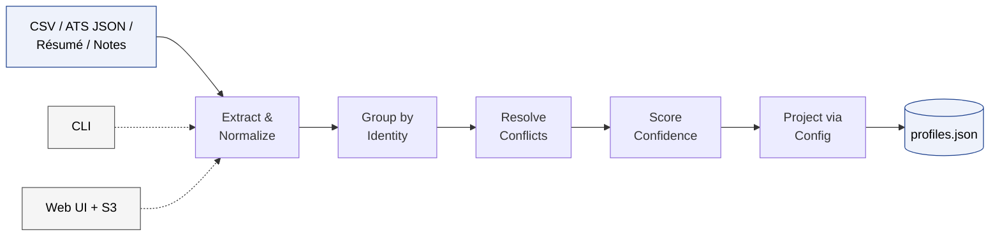

# Multi-Source Candidate Data Transformer

Merges candidate data from multiple structured/unstructured sources (CSV, ATS JSON, résumé, recruiter notes) into one canonical, confidence-scored, provenance-tracked profile - reshapable at runtime via config, no code changes.

Built for the Eightfold Engineering Intern (Jul–Dec 2026) take-home assignment.

---

## System Architecture



CLI and Web UI are thin wrappers around the same `run_pipeline()` call - the UI just adds file upload/download via S3 around it.

---

## Getting Started - CLI

### 1. Clone & install

```bash
git clone <your-repo-url>
cd eightfold-transformer
pip install -r requirements.txt
```

### 2. Run - default config

```bash
python cli.py --csv sample_inputs/recruiter.csv --ats-json sample_inputs/ats.json --resume sample_inputs/resume.docx --notes sample_inputs/notes.txt --out output/profiles.json
```

### 3. Run - custom config

```bash
python cli.py --csv sample_inputs/recruiter.csv --ats-json sample_inputs/ats.json --resume sample_inputs/resume.docx --notes sample_inputs/notes.txt --config config/example_config.json --out output/profiles_custom.json
```

`config/example_config.json` renames fields (`emails[0]` → `primary_email`), re-normalizes phone/skills, subsets the output, and turns provenance off — same engine, same code path as the default.

### 4. Run - with the conflict-resolution ledger

```bash
python cli.py --csv sample_inputs/recruiter.csv --ats-json sample_inputs/ats.json --resume sample_inputs/resume.docx --notes sample_inputs/notes.txt --verbose --out output/profiles.json
```

`--verbose` prints one line per non-trivial resolution decision to stderr - e.g. the résumé's fully-detailed experience entry beating the ATS's bare company name via `density_win`.

Other useful flags: `--batch-dir sample_inputs/batch` (multi-candidate batch mode) and `pytest tests/` (run the test suite).

---

## Getting Started - Web UI

The web UI wraps the exact same pipeline the CLI uses (`run_pipeline()` in `cli.py`) - it's strictly an input/output layer. Each run uploads the selected files to **S3**, downloads them back into a local temp folder (so extractors keep reading plain local paths, unchanged), runs the pipeline, and saves `output.json` back to S3 alongside the inputs. **You need your own AWS S3 bucket** to run this - see setup below.

### 1. Clone & install

```bash
git clone <your-repo-url>
cd eightfold-transformer
pip install -r requirements.txt
```
(`flask`, `boto3`, and `python-dotenv` are already included in `requirements.txt`.)

### 2. AWS S3 setup

1. Create an S3 bucket in your AWS account (any region) - e.g. `eightfold-transformer-demo`.
2. Create an IAM user (or use an existing one) with programmatic access and at minimum `s3:PutObject`, `s3:GetObject`, `s3:ListBucket` permissions on that bucket.
3. Generate an access key ID + secret access key for that user.

### 3. Configure environment variables

```bash
cp .env.example .env
```

Edit `.env` with your own values:

| Variable | Description | Example |
|---|---|---|
| `AWS_ACCESS_KEY_ID` | Your IAM user's access key | `AKIA...` |
| `AWS_SECRET_ACCESS_KEY` | Your IAM user's secret key | `wJalrXUtn...` |
| `AWS_DEFAULT_REGION` | Region your bucket lives in | `us-east-1` |
| `S3_BUCKET_NAME` | The bucket you created above | `eightfold-transformer-demo` |

`.env` is gitignored and never committed. Credentials are read via `python-dotenv` into environment variables - never hardcoded anywhere in the code.

### 4. Run the UI

```bash
python ui/app.py
```

Open **http://localhost:5000**. Choose **Full Canonical Profile** or **Custom Config** mode, upload any combination of input files (CSV, ATS JSON, one or more résumés, one or more notes files), and click **Run**. You'll get:
- A **Pretty view**: candidate cards with confidence badges, a skills table, collapsible provenance grouped by field, and inline tags on any field that had a contested resolution.
- A **Raw JSON** tab with the full unfiltered output.
- A **Download JSON** button.

If S3 upload/download fails (bad credentials, missing bucket, network issue), the page shows a clear error message instead of a stack trace or silent failure.

---

## ATS JSON Field Mapping

The ATS source deliberately uses its own field names (per the assignment). Explicit translation table lives in `src/extractors/ats_json_extractor.py`:

| ATS field | Canonical concept |
|---|---|
| `contact.full_name` | `full_name` |
| `contact.email_address` | `emails[]` |
| `contact.mobile` | `phones[]` |
| `current_role.employer` | `experience[].company` |
| `current_role.job_title` | `experience[].title` |
| `current_role.started` / `.ended` | `experience[].start` / `.end` |
| `address.town` / `.state` / `.nation` | `location.city` / `.region` / `.country` |
| `skill_tags[]` | `skills[]` |
| `summary_headline` | `headline` |

---

## Edge Cases Handled

1. Missing/empty source file → extractor returns `[]`, run continues with remaining sources.
2. Conflicting names across sources sharing an email → still grouped (email wins), `conflicting_name` logged, confidence affected.
3. Phone with no country code → defaults to US region; unparseable numbers keep the raw string and are flagged `normalize_failed`.
4. Skill synonyms/casing (`"js"`/`"React.js"`/`"ml"`) → canonicalization dict, unknown skills pass through Title-Cased.
5. Garbage/malformed JSON (ATS) → caught at the extractor, treated as an empty source, no crash.
6. Config requests a field path that doesn't exist anywhere → follows `on_missing` (`null`/`omit`/`error`), never crashes.
7. Duplicate experience entries describing the same role from two sources → deduped by company + overlapping date range, richer entry's summary wins.
8. Richness tie with no clear winner → falls through to rank, then to `unresolved_conflict` if rank also ties.
9. A source missing the shared identity key (e.g. a résumé where regex couldn't find an email) → falls back to fuzzy name + a corroborating signal, flagged `weak_match`, confidence capped at 0.6.
10. Two different people sharing a name with no corroborating signal → stay as two separate profiles, never merged on name alone.

---

## Scale

Grouping is a dict keyed by identity hash with indexed lookups, not a linear scan or graph traversal - verified empirically at 10,000 candidates in under 3 seconds. Shared CSV/ATS-JSON files are read once and split into per-candidate batches rather than re-opened per candidate. No database, caching layer, or distributed processing was built - a deliberate scope decision for an assignment-scale demo, not an oversight.

---

## Tests

```bash
pytest tests/
```

49 tests across normalization, identity matching (including the false-merge regression), conflict resolution (density win / rank fallback / unresolved conflict), projection, and end-to-end schema validation against both the default and a custom config.


